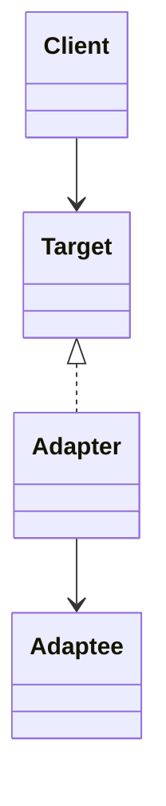

# Review Cycle 1 Checklist - Patterns

Date prepared: 2026-05-06  
Owner: Filippo (`s348651`)  
Feedback recipient: Stefano
Review window target: by 2026-05-10

## Feedback for Stefano

### 1. Proxy Pattern

The current Proxy Pattern example may be weak and should be justified more clearly.

Current candidate:

- `AbstractLogger`: Proxy
- `Logger`: Subject

Questions for Stefano:

1. What is the RealSubject represented by `AbstractLogger`?
2. How should we interpret the role of `AbstractLogger`: as an access-control/delegation layer, or as a shared base implementation for logger behavior, as abstract classes often do?
3. Is Proxy still the strongest interpretation, or would Adapter/Singleton be easier to defend with the selected modules?

`Q1:`
`Q2:`
`Q3:`

Suggested action:

- Keep Proxy only if the Subject, Proxy, RealSubject (and Client) can be clearly identified.
- If this mapping cannot be justified, replace Proxy with a stronger pattern.
- Recommended replacement: Adapter Pattern in `log4j-slf4j2-impl`, using `Log4jLogger` / `Log4jLoggerFactory` as adapters between SLF4J and Log4j2.
- Alternative replacement: Singleton Pattern in `StatusLogger`.

### 2. Better explanation

The current Patterns section already has a good base structure: involved classes, location, purpose, why used, and alternatives.

The improvement should focus on making the pattern mapping easier to defend.

Suggested action:

- Add a short summary table immediately after the `## Patterns` heading, before the detailed explanations of individual patterns. Without this table, the section is harder to understand at first reading.
- For each pattern, add one short sentence explaining the concrete interaction between the involved classes.
- Make clear why the example is a real instance of that pattern, not only a generic similarity.
- When helpful, add a small Mermaid diagram to show the class relationship or call flow.
- Keep diagrams small, so they support the text without making the section too long.

Suggested summary table format:

| Pattern | Main classes/components | Module |
|---|---|---|
| Adapter | `Log4jLogger`, `Log4jLoggerFactory` | `log4j-slf4j2-impl` |
| Builder | `ConsoleAppender.Builder`, `ConsoleAppender` | `log4j-core` |

Example diagram format:

The diagrams should be concise and should only include the classes needed to explain the pattern.

### 3. Minor refinements

Suggested action:

- Use precise file paths for the main examples instead of only shortened paths with `...`.
- Avoid very strong claims such as saying that one pattern is the primary reason for extensibility.
- Keep the links with dependency hotspots only where the relationship is direct and easy to justify.

### 4. Summary consistency

If the Patterns section changes, the Pattern Impact part of the Summary must be updated accordingly.

Suggested action:

- Remove Proxy references from the Summary if Proxy is replaced.
- Align Strategy references with the actual Strategy example used in the Patterns section.
- Soften strong claims that depend on pattern interpretation.
- Keep Summary claims consistent with the final selected pattern set.

## Required Pattern Changes

- [ ] Answer the Proxy Pattern questions and keep Proxy only if the mapping is clearly justified.
- [ ] If Proxy is replaced, prefer Adapter in `log4j-slf4j2-impl` or Singleton in `StatusLogger`.
- [ ] Add a short summary table immediately after the `## Patterns` heading.
- [ ] Add a short explanation of the concrete interaction between the classes of each pattern.
- [ ] Add small Mermaid diagrams where they make the pattern structure easier to understand.
- [ ] Use precise file paths for the main pattern examples.
- [ ] Soften overstrong claims and keep dependency-hotspot links evidence-based.
- [ ] Check that every pattern example belongs to the selected five-module scope.
- [ ] Update the Pattern Impact summary after changing the Patterns section.
