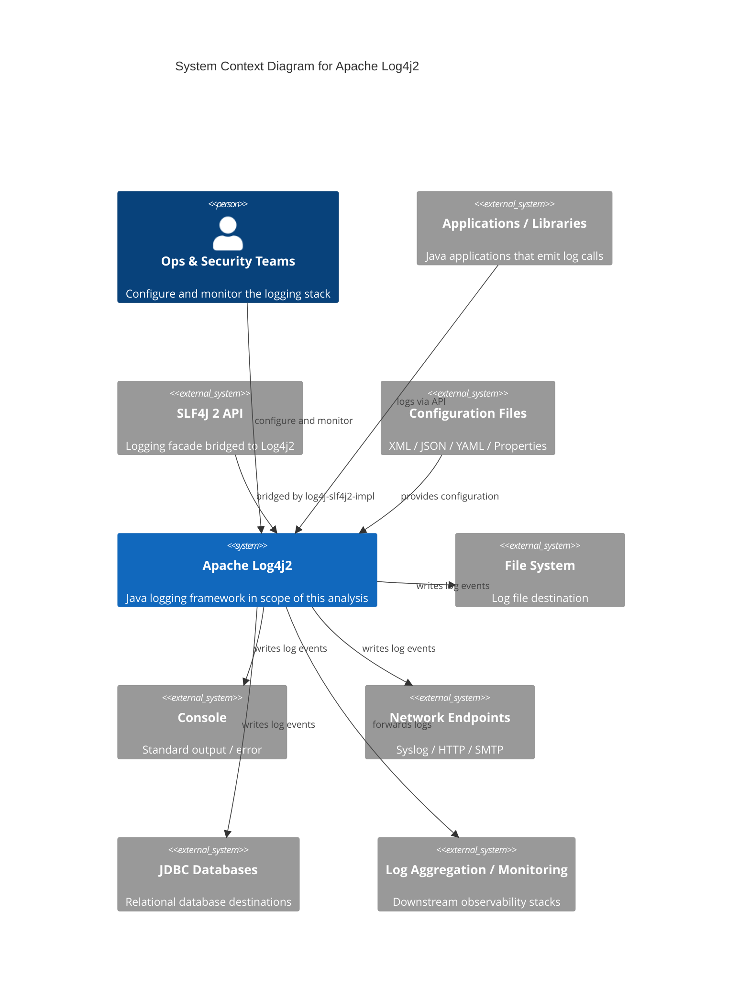
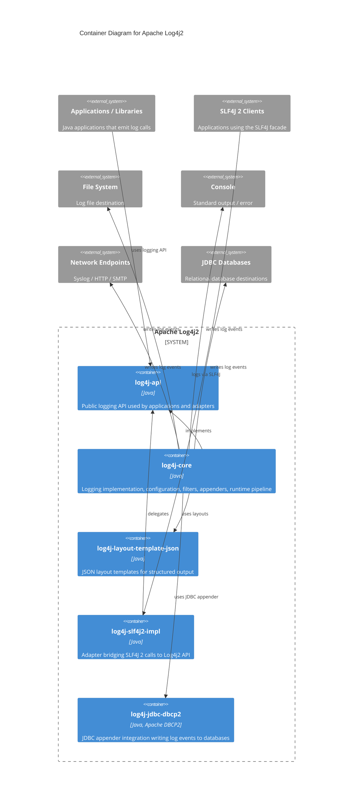
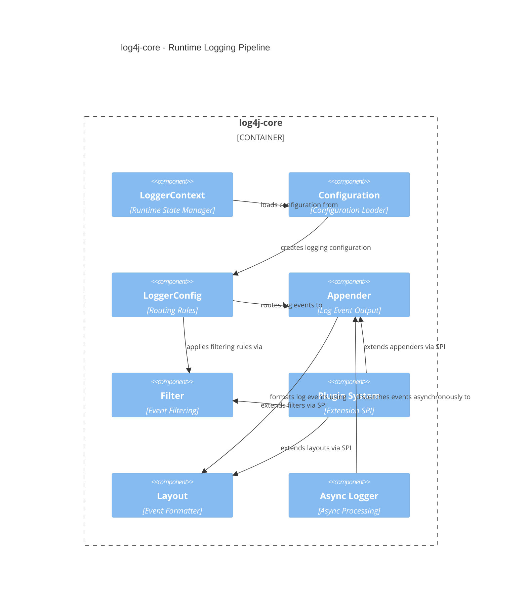
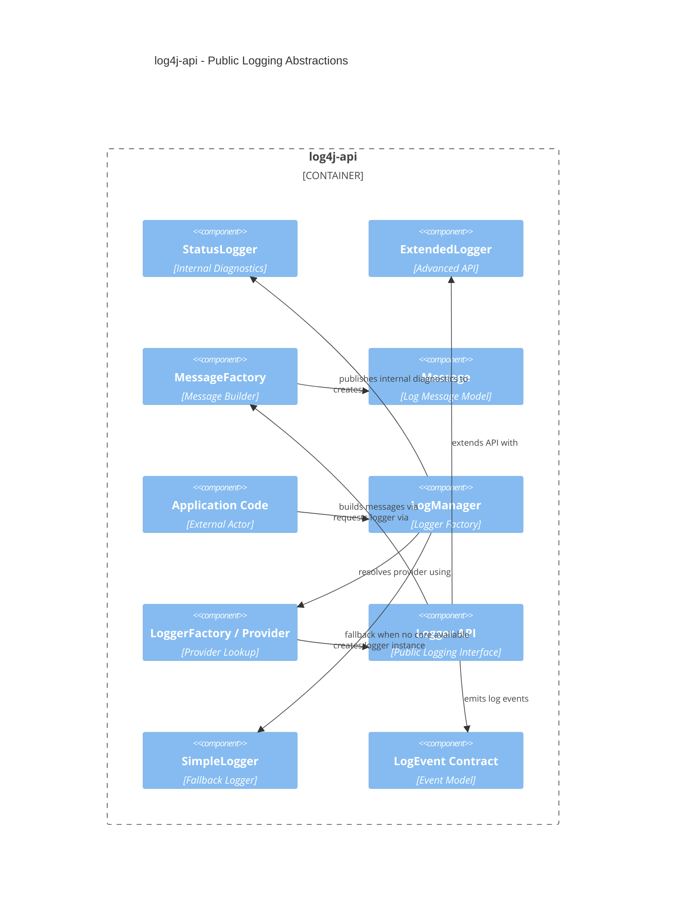
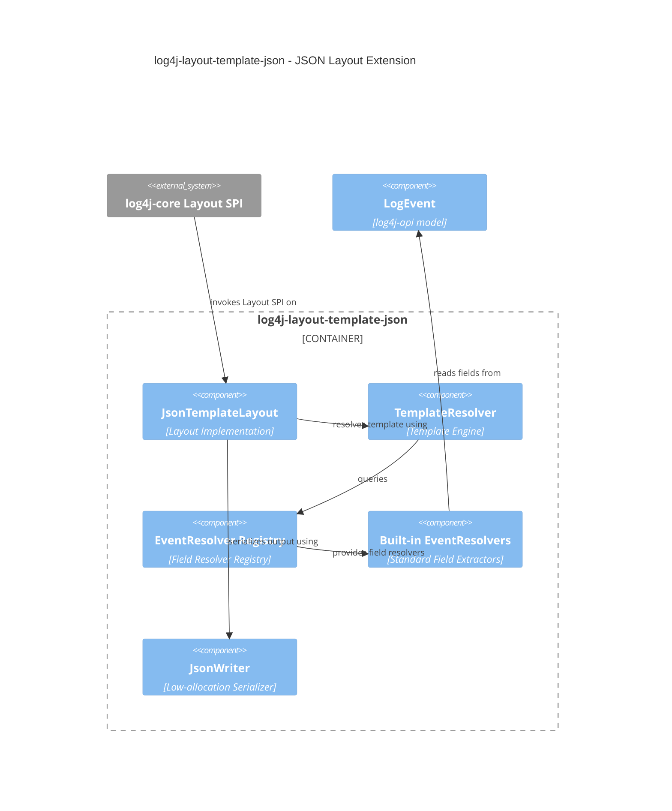
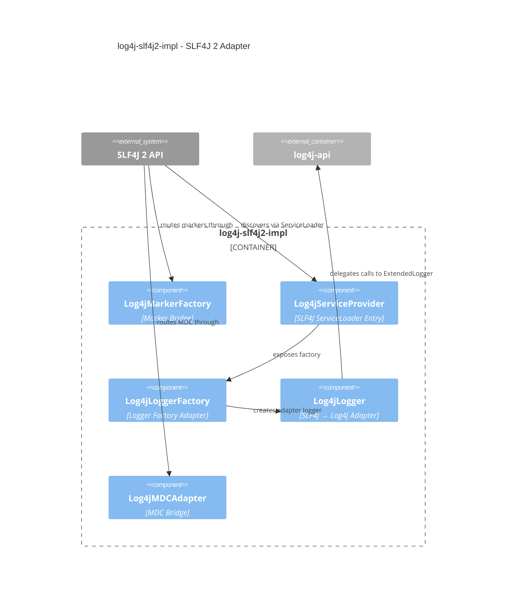
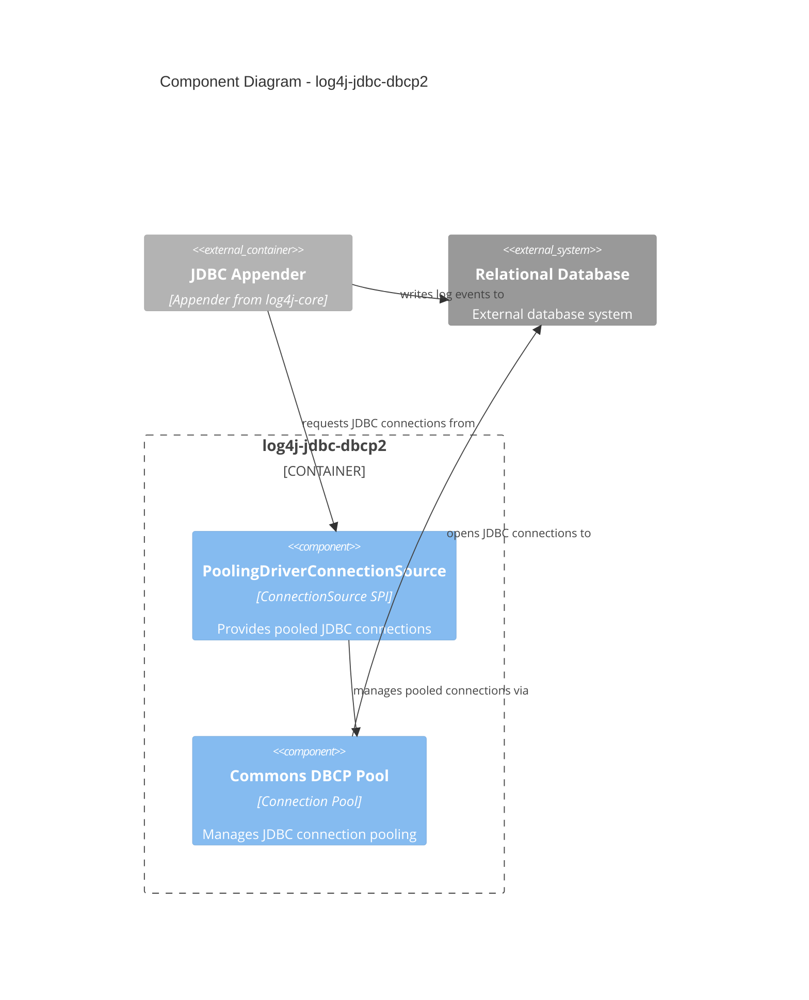
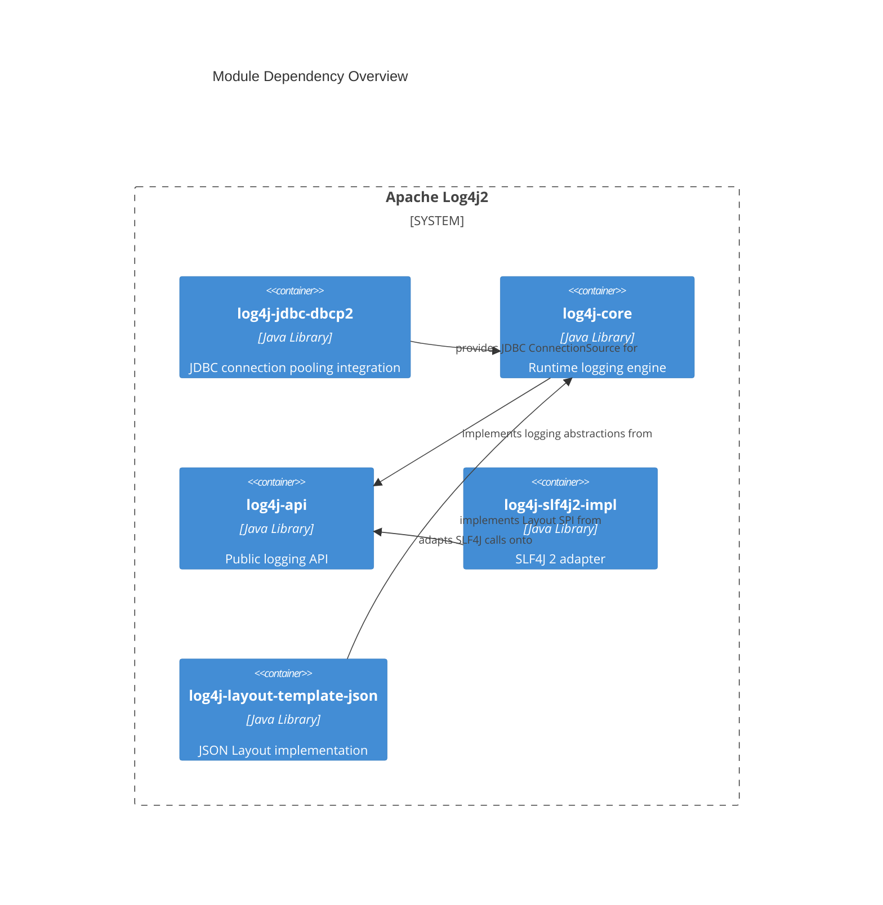

# Software Architecture — Apache Log4j2

**C4 Model Tool Used:** Mermaid diagrams embedded in Markdown.

---

## Context Level (C1)

### System Context Diagram

### Context Description
Apache Log4j2 is a Java logging framework used as a library inside applications.
The system boundary includes the Log4j2 API and implementation modules; external
actors include application developers, operations and security teams, and
systems that receive log output. Log4j2 reads configuration from files, accepts
log calls from applications or the SLF4J facade, and delivers formatted log
events to files, consoles, network endpoints, databases, or monitoring stacks.

---

## Container Level (C2)

### Container Diagram

### Container Description
The analyzed scope is a set of Java library modules that are packaged together
and embedded into JVM applications. Containers correspond to the main Maven
modules included in the analysis scope.

#### Containers:
1. **log4j-api**
   - Type: Java library
   - Technology: Java
   - Responsibility: Public logging API used by applications and adapters.

2. **log4j-core**
   - Type: Java library
   - Technology: Java
   - Responsibility: Logging implementation, configuration, filters, appenders, and runtime pipeline.

3. **log4j-layout-template-json**
   - Type: Java library
   - Technology: Java
   - Responsibility: JSON layout templates used by core for structured output.

4. **log4j-slf4j2-impl**
   - Type: Java library
   - Technology: Java
   - Responsibility: Adapter that bridges SLF4J 2 calls to Log4j2 API.

5. **log4j-jdbc-dbcp2**
   - Type: Java library
   - Technology: Java, Apache DBCP2
   - Responsibility: JDBC appender integration that writes log events to databases.

### Relationship with Clean Architecture Blueprint
The module split between `log4j-api` and `log4j-core` reflects a boundary between
stable interfaces and implementation details, which aligns with Clean
Architecture separation of abstractions from concrete mechanisms. The
implementation module depends on the API, not the other way around, which keeps
the public surface stable. However, Log4j2 is a library framework rather than a
traditional layered application, so the plugin system and appenders are built
inside the core module instead of as isolated outer layers. This trade-off favors
performance and configurability over a strict inward-only dependency rule.

---

## Component Level (C3)

### Component Diagrams

#### Diagram of `log4j-core`

 
#### Diagram of `log4j-api`

#### Diagram of `log4j-layout-template-json`

#### Diagram of `log4j-slf4j2-impl`

#### Diagram of `log4j-jdbc-dbcp2`

#### Module Dependency Overview

The 816 cross-module import edges between `log4j-core` and `log4j-api` and the central hotspots `Plugin.java`, `LogEvent.java`, and `StatusLogger.java` (see [`analysis/dependencies/architecture_handoff_packet.md`].) confirm that the API/Core split is the main extensibility boundary, while the three peripheral modules plug into that boundary via the `Layout`, `Appender`, and provider SPIs.

### Container: `log4j-api`

#### Container Description
The log4j-api container provides public logging interface used by applications and libraries. It defines the core abstractions for creating loggers, creating log messages, and interacting with logging system independently of the runtime implementation.

Components:

1. Logger API
   - Responsibility: Provides public logging interface used by applications.
2. LogManager
   - Responsibility: Creates and retrieves logger instances.
3. Message Factory
   - Responsibility: Supports structured and parameterized logging messages.
4. Simple Logger
   - Responsibility: Provides minimal default logging implementation.

### Container: `log4j-core` 

#### Container Description
The log4j-core container has the primary runtime implementation of Log4j2. It is responsible for configuration management, log event processing, filtering, formatting, plugin extensibility, and output delivery.

Components:

1. LoggerContext
   - Responsibility: Maintains runtime logging state and logger lifecycle management.
2. Configuration
   - Responsibility: Loads and manages logging configuration.
3. Appender
   - Responsibility: Sends log events to output destinations.
4. Layout
   - Responsibility: Formats log events before output.
5. Filter
   - Responsibility: Determines whether log events should be processed.
6. Plugin System
   - Responsibility: Supports extensibility for appenders, layouts, and filters.
7. Async Logger
   - Responsibility: Provides asynchronous log event processing.

### Container: `log4j-layout-template-json`

#### Container Description
The `log4j-layout-template-json` container provides a fast, garbage-free `Layout` implementation that serializes a `LogEvent` into JSON according to a user-supplied template. It plugs into the Layout SPI exposed by `log4j-core` and is the recommended layout for modern observability pipelines (ELK, OpenSearch, Loki) where structured rather than free-text output is required.

**Components:**

1. **JsonTemplateLayout**
   - Responsibility: Entry point implementing the core `Layout` interface; orchestrates template parsing and event serialization.
2. **TemplateResolver / EventResolver registry**
   - Responsibility: Parses the JSON template once at startup and binds each placeholder to a resolver that knows how to read a specific field from a `LogEvent`.
3. **Built-in EventResolvers**
   - Responsibility: Provide out-of-the-box resolution for common fields (timestamp, level, message, thread, MDC, exception, stack trace).
4. **JsonWriter**
   - Responsibility: Low-allocation JSON encoder used by resolvers to write output buffers efficiently.

### Container: `log4j-slf4j2-impl`

#### Container Description
The `log4j-slf4j2-impl` container is the **Adapter** between the SLF4J 2 API and the Log4j2 API. Applications that program against SLF4J can switch to Log4j2 as the runtime backend simply by placing this artifact on the classpath; the SLF4J `ServiceLoader` discovery then routes every SLF4J call into `log4j-api`.

**Components:**

1. **Log4jServiceProvider**
   - Responsibility: SLF4J 2 service provider entry point; discovered via `ServiceLoader` and exposes the factory and adapters to SLF4J.
2. **Log4jLoggerFactory**
   - Responsibility: Creates SLF4J `Logger` instances backed by Log4j2.
3. **Log4jLogger (Adapter)**
   - Responsibility: Adapts each SLF4J `Logger` call to the corresponding `ExtendedLogger` call in `log4j-api`.
4. **Log4jMarkerFactory / Log4jMDCAdapter**
   - Responsibility: Bridge SLF4J marker and MDC concepts onto the Log4j2 equivalents.

### Container: `log4j-jdbc-dbcp2`

#### Container Description
The `log4j-jdbc-dbcp2` container supplies a pooled JDBC `ConnectionSource` for the JDBC Appender defined in `log4j-core`. It uses Apache Commons DBCP 2 to keep connection acquisition cheap when log events are persisted to a relational database.

**Components:**

1. **PoolingDriverConnectionSource**
   - Responsibility: Implements the `ConnectionSource` SPI expected by the JDBC Appender and hands out pooled connections.
2. **Commons DBCP pool integration**
   - Responsibility: Configures and manages the underlying connection pool (sizing, validation, eviction).

### Out-of-Scope Context

Additional Log4j2 integration modules exist outside the selected scope, but they are not expanded at C3 level because the analyzed modules already cover the primary API/runtime boundary, extension SPI mechanisms, external adapters, and infrastructure integrations required for this analysis.

### SOLID Principles Analysis at Level 3

The Log4j2 architecture demonstrates an emphasis on modularity, extensibility, and separation of concerns through clear distinction between API components, runtime core components, and external integration modules. Architectural decomposition of the system mostly aligns well with several SOLID principles, particularly regarding extensibility, modular separation, and interface-based integration. This is achieved through the use of plugin-based extensibility, abstraction layers, and separation between `log4j-api` and `log4j-core`.

At component level, the architecture generally maintains high cohesion by assigning focused responsibilities to components such as `Appender`, `Layout`, `Filter`, and `Log4jLogger`. Integration modules isolate interoperability concerns from the runtime engine, improving maintainability and reducing unnecessary subsystem dependencies.

#### SOLID Findings:

- **Finding 1** — Open/Closed Principle through Plugin System

Type: Architectural Strength

Explanation:
The Plugin System allows appenders, layouts, and filters to be extended without modifying existing runtime components. Modules such as `log4j-layout-template-json` integrate through extension points while remaining decoupled from the internal implementation of the logging engine.

Evidence:
`Plugin.java` and SPI-based plugin registration mechanisms enable runtime discovery and integration of external components.

Location: `log4j-core` -> Plugin System

- **Finding 2** — Dependency Inversion through API/Core separation

Type: Architectural strength

Explanation: 
Applications and integration modules depends primarily on abstractions provided by `log4j-api` rather than concrete runtime implementations in `log4j-core`. Strong separation between API and runtime implementation reduces coupling and improves modular extensibility.

Evidence: 
High cross-module dependency concentration between `log4j-api` and `log4j-core` (816 import edges) identified in dependency analysis.

Location: Relationship between `log4j-api` and `log4j-core`

- **Finding 3** — Single Responsibility Principle trade-off in LoggerContext

Type: Architectural trade-off

Explanation:
`LoggerContext` manages runtime state, lifecycle coordination, configuration handling, and reconfiguration processes. While centralized management simplifies runtime coordination, combining multiple responsibilities increases component complexity and partially weakens strict Single Responsibility Principle alignment.

Evidence:
`LoggerContext` coordinates configuration loading, runtime state management, and reconfiguration workflows across multiple runtime subsystems.

Location: `log4j-core` -> `LoggerContext`

- **Finding 4** — Adapter-based integration supports Interface Segregation

Type: Architectural strength

Explanation: `log4j-slf4j2-impl` module isolates SLF4J interoperability concerns into dedicated adapter components such as `Log4jLogger` and `Log4jServiceProvider`. This prevents external logging abstractions from leaking directly into the core runtime architecture.

Evidence: Adapter classes (`Log4jLogger`, `Log4jServiceProvider`) isolate SLF4J API dependencies from `log4j-core`.

Location: `log4j-slf4j2-impl`

#### SOLID Findings as Table:

| Finding | Type | Explanation | Evidence | Location |
|---|---|---|---|---|
| Open/Closed Principle through Plugin System | Architectural Strength | The plugin architecture allows appenders, layouts, and filters to be extended without modifying existing runtime components. Modules such as `log4j-layout-template-json` integrate through extension points while remaining decoupled from the internal logging pipeline. | `Plugin.java` extension mechanism and SPI-based plugin registration. | `log4j-core` → Plugin System |
| API/Core Separation improves modularity | Architectural Strength | `log4j-api` provides stable abstractions while `log4j-core` contains runtime implementations. Peripheral modules integrate mainly through APIs and SPIs rather than directly modifying runtime internals. | Dependency analysis identified 816 import edges from `log4j-core` to `log4j-api`, confirming the central architectural role of the API module. | Relationship between `log4j-api` and `log4j-core` |
| Single Responsibility Principle trade-off in `LoggerContext` | Architectural Trade-off | `LoggerContext` coordinates runtime state, lifecycle management, configuration handling, and reconfiguration workflows. Centralized coordination simplifies runtime management but increases component complexity. | `LoggerContext` interacts with configuration loading, runtime state management, and reconfiguration subsystems. | `log4j-core` → `LoggerContext` |
| Adapter-based integration supports Interface Segregation | Architectural Strength | The `log4j-slf4j2-impl` module isolates SLF4J interoperability concerns into dedicated adapter components, preventing external logging abstractions from leaking into runtime internals. | `Log4jLogger` and `Log4jServiceProvider` isolate SLF4J API dependencies from `log4j-core`. | `log4j-slf4j2-impl` |

---

## Architectural Characteristics

### Quality Attributes Supported by the Architecture

#### Characteristic 1 - Extensibility
- **Definition:** The ability of the system to support new functionality without requiring major modifications to existing components.
- **How Supported:** Log4j2 supports extensibility through its plugin-based architecture, SPI extension points, and modular separation between `log4j-api` and `log4j-core`. Components such as layouts, appenders, and adapters can be added independently through the plugin registration and interface-based integration.
- **Evidence:** `Plugin.java` extension mechanism allows modules such as `log4j-layout-template-json` to integrate with the Layout SPI without modifying `log4j-core`.

#### Characteristic 2 - Interoperability
- **Definition:** The ability of architecture to interact with external frameworks, APIs, and infrastructure systems.
- **How Supported:** Log4j2 isolates interoperability concerns to dedicated adapter and integration modules. External logging frameworks communicate with system through bridge components rather than coupling to runtime internals.
- **Evidence:** "log4j-slf4j2-impl" module adapts SLF4J 2 API calls into `log4j-api` through components such as `Log4jLogger` and `Log4jServiceProvider`.

#### Characteristic 3 - Maintainability
- **Definition:** The ability of the system to support modification, extension, and long-term evolution/support with minimal impact on existing components.
- **How Supported:** Log4j2 separates API abstractions, runtime implementations, adapters, and extension modules into distinct *`Maven artifacts`*. Components communicate primarily through interfaces, SPIs, and plugin contracts, reducing direct subsystem dependency.
- **Evidence:** The separation between `log4j-api`, `log4j-core`, `log4j-layout-template-json`, `log4j-slf4j2-impl`, and `log4j-jdbc-dbcp2` isolates responsibilities into dedicated modules connected through APIs and SPIs. This modularization allows features such as JSON layouts, SLF4J adaptation, and JDBC connection pooling to evolve independently without modifying the primary runtime pipeline.

#### Characteristic 4 - Performance and Scalability
- **Definition:** The ability of the system to efficiently process increased workloads while minimizing runtime overhead.
- **How Supported:** Log4j2 uses asynchronous logging, pooled resource management, and low-allocation serialization mechanisms to reduce runtime overhead and improve throughput under high logging loads.
- **Evidence:** Async Logger supports asynchronous event-processing inside `log4j-core`, while `JsonWriter` in `log4j-layout-template-json` lowers allocation overhead during JSON serialization. The `PoolingDriverConnectionSource` in `log4j-jdbc-dbcp2` reduces database connection acquisition costs through connection pooling.

### Coupling and Cohesion Metrics (Optional)

Dependency analysis identified approximately 816 cross-module import relationships between `log4j-api` and `log4j-core`, confirming that the API/Core boundary represents the central architectural dependency within the selected scope.

At component level, the architecture generally demonstrates high cohesion. Components such as `Appender`, `Layout`, `Filter`, and `Log4jLogger` maintain focused responsibilities and interact primarily through clearly defined interfaces and SPIs. Peripheral modules such as `log4j-layout-template-json` and `log4j-slf4j2-impl` remain relatively loosely coupled because they integrate through extension points rather than direct runtime modification.

| Metric | Value | Assessment |
|--------|-------|------------|
| API/Core Import Coupling| 816 import edges | High but expected due to implementation relationship |
| Component Cohesion | High | Most components maintain focused responsibilities |
| Tightly Coupled Pairs | log4j-api ↔ log4j-core | Central architectural dependency |
| Plugin-Based Extension Points | Multiple SPI interfaces | Supports low coupling for extensions |

The dependency structure reflects a hub-and-spoke architecture centered around `log4j-core`, while peripheral modules integrate primarily through stable interfaces, adapters, and SPI extension points rather than direct runtime modification.

---

## Summary

The selected Log4j2 modules demonstrate a modular and extensible architecture centered around the separation between `log4j-api` and `log4j-core`. The architecture strongly supports extensibility through plugin-based components, SPI-driven integration mechanisms, and adapter modules such as `log4j-layout-template-json`, `log4j-slf4j2-impl`, and `log4j-jdbc-dbcp2`.

The component-level analysis demonstrates generally strong alignment with several SOLID principles, particularly Open/Closed Principle, Dependency Inversion Principle, and Interface Segregation Principle. The dependency analysis and component diagrams indicate that extensibility is achieved primarily through stable interfaces, plugin registration mechanisms, and adapter-based integration rather than direct modification of runtime components. Some architectural trade-offs remain present, especially in runtime coordination components such as LoggerContext, where centralized management increases component responsibility and complexity in exchange for simpler runtime orchestration.

Overall, the analyzed architecture demonstrates strong modular decomposition, high component cohesion, and controlled coupling around the API/Core boundary while maintaining extensibility, interoperability, maintainability, and runtime performance across the selected scope.

---
