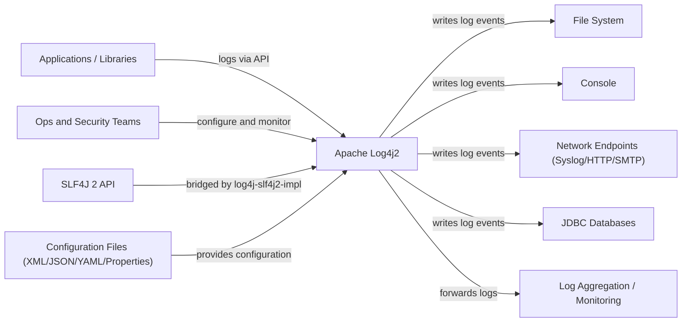
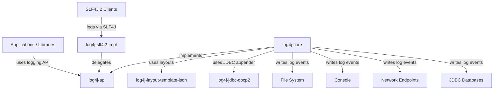

# Software Architecture — Apache Log4j2

**C4 Model Tool Used:** Mermaid diagrams embedded in Markdown.

---

## Context Level (C1)

### System Context Diagram

### Context Description
Apache Log4j2 is a Java logging framework used as a library inside applications.
The system boundary includes the Log4j2 API and implementation modules; external
actors include application developers, operations and security teams, and
systems that receive log output. Log4j2 reads configuration from files, accepts
log calls from applications or the SLF4J facade, and delivers formatted log
events to files, consoles, network endpoints, databases, or monitoring stacks.

---

## Container Level (C2)

### Container Diagram

### Container Description
The analyzed scope is a set of Java library modules that are packaged together
and embedded into JVM applications. Containers correspond to the main Maven
modules included in the analysis scope.

#### Containers:
1. **log4j-api**
   - Type: Java library
   - Technology: Java
   - Responsibility: Public logging API used by applications and adapters.

2. **log4j-core**
   - Type: Java library
   - Technology: Java
   - Responsibility: Logging implementation, configuration, filters, appenders, and runtime pipeline.

3. **log4j-layout-template-json**
   - Type: Java library
   - Technology: Java
   - Responsibility: JSON layout templates used by core for structured output.

4. **log4j-slf4j2-impl**
   - Type: Java library
   - Technology: Java
   - Responsibility: Adapter that bridges SLF4J 2 calls to Log4j2 API.

5. **log4j-jdbc-dbcp2**
   - Type: Java library
   - Technology: Java, Apache DBCP2
   - Responsibility: JDBC appender integration that writes log events to databases.

### Relationship with Clean Architecture Blueprint
The module split between `log4j-api` and `log4j-core` reflects a boundary between
stable interfaces and implementation details, which aligns with Clean
Architecture separation of abstractions from concrete mechanisms. The
implementation module depends on the API, not the other way around, which keeps
the public surface stable. However, Log4j2 is a library framework rather than a
traditional layered application, so the plugin system and appenders are built
inside the core module instead of as isolated outer layers. This trade-off favors
performance and configurability over a strict inward-only dependency rule.

---

## Component Level (C3)

### Component Diagrams
[Include C3 Component diagrams for the most relevant containers. If some containers are not expanded, explain why.]

#### Container: [Container Name]

**Components:**
1. **[Component Name]**
   - Responsibility: [Main purpose]

2. **[Component Name]**
   - Responsibility: [Main purpose]

### SOLID Principles Analysis at Level 3

[Analyze whether any SOLID violations are observed at component level. If none are strong enough, explain the main SOLID-related trade-offs.]

#### SOLID Findings:
- [Finding 1]: [Violation, trade-off, or strength with explanation and location]
- [Finding 2]: [Violation, trade-off, or strength with explanation and location]

---

## Architectural Characteristics

### Quality Attributes Supported by the Architecture

#### [Characteristic 1 - e.g., Scalability]
- **Definition:** [Brief description]
- **How Supported:** [Architectural mechanisms that support this]
- **Evidence:** [Examples from the architecture]

#### [Characteristic 2 - e.g., Reliability]
- **Definition:** [Brief description]
- **How Supported:** [Architectural mechanisms that support this]
- **Evidence:** [Examples from the architecture]

#### [Characteristic 3 - e.g., Extensibility]
- **Definition:** [Brief description]
- **How Supported:** [Architectural mechanisms that support this]
- **Evidence:** [Examples from the architecture]

### Coupling and Cohesion Metrics (Optional)

[Optional: Include analysis of component coupling and cohesion metrics to support your reasoning, if available]

| Metric | Value | Assessment |
|--------|-------|------------|
| Average Component Coupling | | |
| Average Component Cohesion | | |
| Tightly Coupled Pairs | | |

---

## Summary

[Overall architectural assessment and findings]

---
