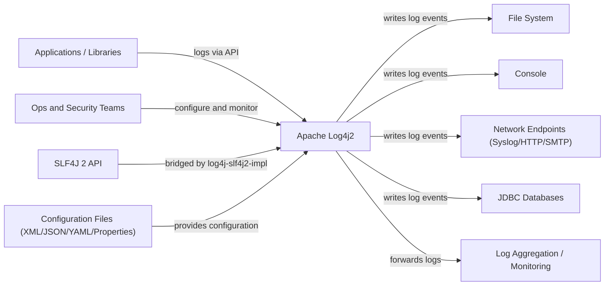
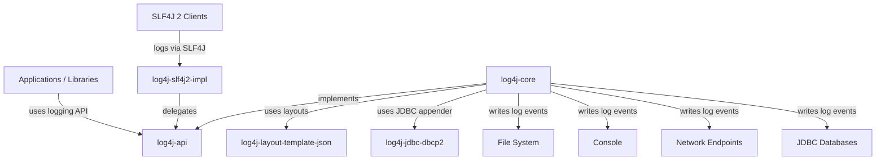
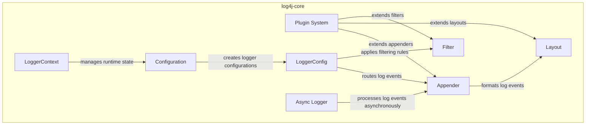
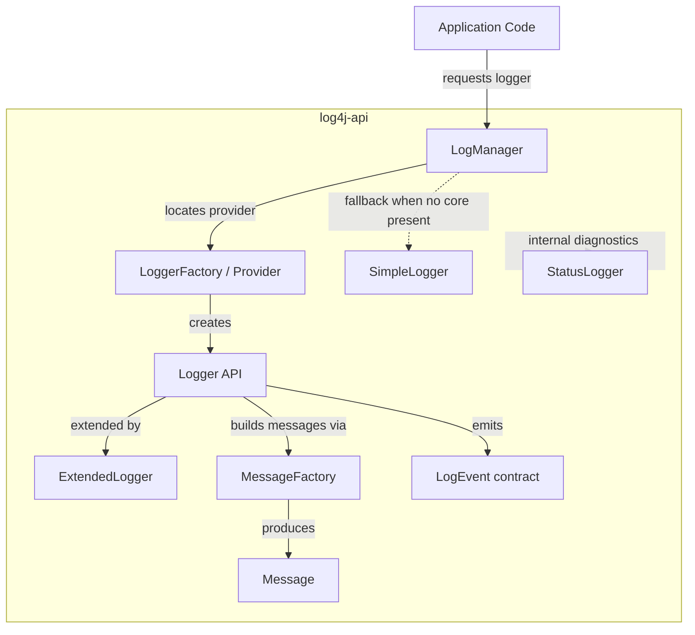
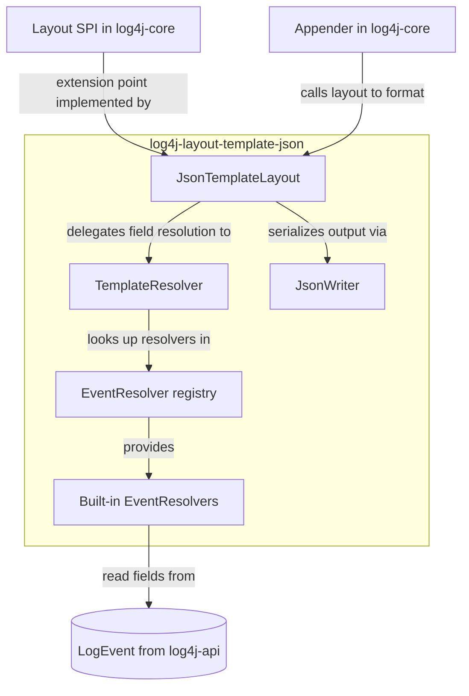
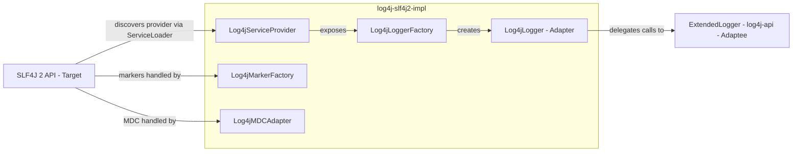
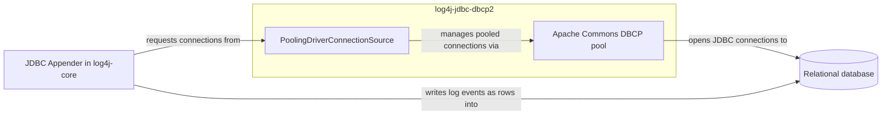
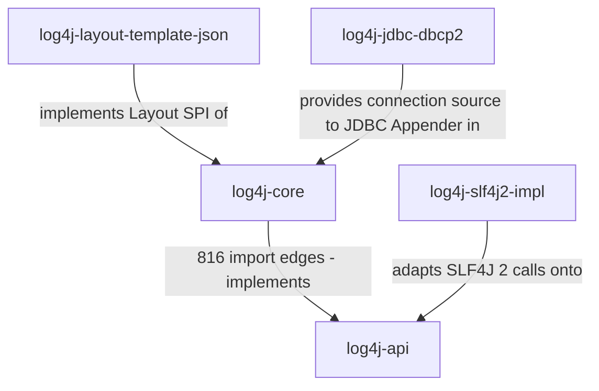

# Software Architecture — Apache Log4j2

**C4 Model Tool Used:** Mermaid diagrams embedded in Markdown.

---

## Context Level (C1)

### System Context Diagram

### Context Description
Apache Log4j2 is a Java logging framework used as a library inside applications.
The system boundary includes the Log4j2 API and implementation modules; external
actors include application developers, operations and security teams, and
systems that receive log output. Log4j2 reads configuration from files, accepts
log calls from applications or the SLF4J facade, and delivers formatted log
events to files, consoles, network endpoints, databases, or monitoring stacks.

---

## Container Level (C2)

### Container Diagram

### Container Description
The analyzed scope is a set of Java library modules that are packaged together
and embedded into JVM applications. Containers correspond to the main Maven
modules included in the analysis scope.

#### Containers:
1. **log4j-api**
   - Type: Java library
   - Technology: Java
   - Responsibility: Public logging API used by applications and adapters.

2. **log4j-core**
   - Type: Java library
   - Technology: Java
   - Responsibility: Logging implementation, configuration, filters, appenders, and runtime pipeline.

3. **log4j-layout-template-json**
   - Type: Java library
   - Technology: Java
   - Responsibility: JSON layout templates used by core for structured output.

4. **log4j-slf4j2-impl**
   - Type: Java library
   - Technology: Java
   - Responsibility: Adapter that bridges SLF4J 2 calls to Log4j2 API.

5. **log4j-jdbc-dbcp2**
   - Type: Java library
   - Technology: Java, Apache DBCP2
   - Responsibility: JDBC appender integration that writes log events to databases.

### Relationship with Clean Architecture Blueprint
The module split between `log4j-api` and `log4j-core` reflects a boundary between
stable interfaces and implementation details, which aligns with Clean
Architecture separation of abstractions from concrete mechanisms. The
implementation module depends on the API, not the other way around, which keeps
the public surface stable. However, Log4j2 is a library framework rather than a
traditional layered application, so the plugin system and appenders are built
inside the core module instead of as isolated outer layers. This trade-off favors
performance and configurability over a strict inward-only dependency rule.

---

## Component Level (C3)

### Component Diagrams

#### Diagram of Lo4j-core

 
#### Diagram of log4j-api

#### Diagram of log4j-layout-template-json

#### Diagram of log4j-slf4j2-impl

#### Diagram of log4j-jdbc-dbcp2

#### Scope Overview

The 816 cross-module import edges between `log4j-core` and `log4j-api` and the central hotspots `Plugin.java`, `LogEvent.java`, and `StatusLogger.java` (see [`analysis/dependencies/architecture_handoff_packet.md`](../analysis/dependencies/architecture_handoff_packet.md)) confirm that the API/Core split is the main extensibility boundary, while the three peripheral modules plug into that boundary via the `Layout`, `Appender`, and provider SPIs.

### Container: log4j-api

#### Container Description
The log4j-api container provides public logging interface used by applications and libraries. It defines the core abstractions for creating loggers, creating log messages, and interacting with logging system independently of the runtime implementation.

Components:

1. Logger API
   - Responsibility: Provides public logging interface used by applications.
2. LogManager
   - Responsibility: Creates and retrieves logger instances.
3. Message Factory
   - Responsibility: Supports structurized and parameterized logging messages.
4. Simple Logger
   - Responsibility: Provides minimal default logging implementation.

### Container: log4j-core 

#### Container Description
The log4j-core container has the primary runtime implementation of Log4j2. It is responsible for configuration management, log event processing, filtering, formatting, plugin extensibility, and output delivery.

Components:

1. LoggerContext
   - Responsibility: Maintains runtime logging state and logger lifecycle management.
2. Configuration
   - Responsibility: Loads and manages logging configuration.
3. Appender
   - Responsibility: Sends log events to output destinations.
4. Layout
   - Responsibility: Formats log events before output.
5. Filter
   - Responsibility: Determines whether log events should be processed.
6. Plugin System
   - Responsibility: Supports extensibility for appenders, layouts, and filters.
7. Async Logger
   - Responsibility: Provides asynchronous log event processing.

### Container: log4j-layout-template-json

#### Container Description
The `log4j-layout-template-json` container provides a fast, garbage-free `Layout` implementation that serializes a `LogEvent` into JSON according to a user-supplied template. It plugs into the Layout SPI exposed by `log4j-core` and is the recommended layout for modern observability pipelines (ELK, OpenSearch, Loki) where structured rather than free-text output is required.

**Components:**

1. **JsonTemplateLayout**
   - Responsibility: Entry point implementing the core `Layout` interface; orchestrates template parsing and event serialization.
2. **TemplateResolver / EventResolver registry**
   - Responsibility: Parses the JSON template once at startup and binds each placeholder to a resolver that knows how to read a specific field from a `LogEvent`.
3. **Built-in EventResolvers**
   - Responsibility: Provide out-of-the-box resolution for common fields (timestamp, level, message, thread, MDC, exception, stack trace).
4. **JsonWriter**
   - Responsibility: Low-allocation JSON encoder used by resolvers to write output buffers efficiently.

### Container: log4j-slf4j2-impl

#### Container Description
The `log4j-slf4j2-impl` container is the **Adapter** between the SLF4J 2 API and the Log4j2 API. Applications that program against SLF4J can switch to Log4j2 as the runtime backend simply by placing this artifact on the classpath; the SLF4J `ServiceLoader` discovery then routes every SLF4J call into `log4j-api`.

**Components:**

1. **Log4jServiceProvider**
   - Responsibility: SLF4J 2 service provider entry point; discovered via `ServiceLoader` and exposes the factory and adapters to SLF4J.
2. **Log4jLoggerFactory**
   - Responsibility: Creates SLF4J `Logger` instances backed by Log4j2.
3. **Log4jLogger (Adapter)**
   - Responsibility: Adapts each SLF4J `Logger` call to the corresponding `ExtendedLogger` call in `log4j-api`.
4. **Log4jMarkerFactory / Log4jMDCAdapter**
   - Responsibility: Bridge SLF4J marker and MDC concepts onto the Log4j2 equivalents.

### Container: log4j-jdbc-dbcp2

#### Container Description
The `log4j-jdbc-dbcp2` container supplies a pooled JDBC `ConnectionSource` for the JDBC Appender defined in `log4j-core`. It uses Apache Commons DBCP 2 to keep connection acquisition cheap when log events are persisted to a relational database.

**Components:**

1. **PoolingDriverConnectionSource**
   - Responsibility: Implements the `ConnectionSource` SPI expected by the JDBC Appender and hands out pooled connections.
2. **Commons DBCP pool integration**
   - Responsibility: Configures and manages the underlying connection pool (sizing, validation, eviction).

### Out-of-Scope Context

Log4j2 ships many additional modules (`log4j-jcl`, `log4j-jul`, `log4j-slf4j-impl`, `log4j-to-jul`, `log4j-to-slf4j`, `log4j-jpl`, `log4j-cassandra`, `log4j-couchdb`, `log4j-mongodb`, `log4j-jpa`, `log4j-docker`). They are intentionally **not** part of the C3 analysis: the five scoped modules already cover the API/Core boundary, a non-trivial Layout SPI implementation, an Adapter to an external logging facade, and an external system integration (JDBC), which is enough surface to discuss every architectural characteristic in scope.

### SOLID Principles Analysis at Level 3

The Log4j2 architecture demonstrates an emphasis on modularity, extensibility, and separation of concerns through clear distinction between API components, runtime core components, and external integration modules. Architectural decomposition of the system mostly aligns well with several SOLID principles, particularly Open/Closed Principle and Dependency Inversion Principle. This is achieved through the use of plugin-based extensibility, abstraction layers, and separation between log4j-api and log4j-core.
At component level, the architecture prefers high cohesion by assigning focused responsibilities to components like "Appender", "Layout", and "Filter". Additionally, integration modules isolate interoperability problems from the core runtime engine, improving maintainability and reduces unneeded dependencies between used subsystems.

#### SOLID Findings:

- Finding 1: Strong Open/Closed Principle support through Plugin System
Type: Architectural strength
Explanation: The Plugin System allows appenders, layouts, filters, and lookups to be extended without modifying existing runtime components. New logging behaviors can be added through plugins while preserving existing functionality.
Location: log4j-core, Plugins

- Finding 2: Strong Dependency Inversion through API/Core separation
Type: Architectural strength
Explanation: Applications mostly depend on abstractions provided by log4j-api rather than concrete implementations in log4j-core. This reduces coupling between client applications and runtime infrastructure.
Location: Relationship between log4j-api and log4j-core

- Finding 3: Partial Single Responsibility Principle trade-off in LoggerContext
Type: Architectural trade-off, Architectural Strenght
Explanation: LoggerContext controls runtime state, logger lifecycle coordination, configuration handling, and reconfiguration processes. Combining multiple runtime responsibilities into a singular component increases complexity but simplifies centralized management. With handling getting simplified, System architectural layout gets stronger.
Location: log4j-core, LoggerContext

- Finding 4: High cohesion within logging pipeline components
Type: Architectural strength
Explanation: Appender, Layout, and Filter components control clearly separated responsibilities within logging pipeline. This improves maintainability, readability, and extensibility of logging process.
Location: log4j-core Appender, Layout, and Filter

- Finding 5: Static logger access partially weakens Dependency Injection practices
Type: Architectural trade-off
Explanation: Use of "LogManager.getLogger()" introduces global or static access mechanism similar to service locator pattern. This reduces explicit dependency management and could make testing harder.
Location: log4j-api, LogManager

- Finding 6: Extensible appenders support Open/Closed Principle
Type: Architectural strength
Explanation: Database and persistence appenders such log4j-cassandra, log4j-mongodb, and log4j-jpa extends by logging functionality without in needing of the modifications to core logging engine.
Location: Database and Persistence Integrations

- Finding 7: Async Logger introduces performance-oriented coupling trade-offs
Type: Architectural trade-off
Explanation: Async Logger improves scalability and throughput through asynchronous processing, but introduces tighter coordination between event queues, runtime state management, and appenders. This increases architectural complexity in exchange for performance optimization.
Location: log4j-core, Async Logger

---

## Architectural Characteristics

### Quality Attributes Supported by the Architecture

#### [Characteristic 1 - e.g., Scalability]
- **Definition:** [Brief description]
- **How Supported:** [Architectural mechanisms that support this]
- **Evidence:** [Examples from the architecture]

#### [Characteristic 2 - e.g., Reliability]
- **Definition:** [Brief description]
- **How Supported:** [Architectural mechanisms that support this]
- **Evidence:** [Examples from the architecture]

#### [Characteristic 3 - e.g., Extensibility]
- **Definition:** [Brief description]
- **How Supported:** [Architectural mechanisms that support this]
- **Evidence:** [Examples from the architecture]

### Coupling and Cohesion Metrics (Optional)

[Optional: Include analysis of component coupling and cohesion metrics to support your reasoning, if available]

| Metric | Value | Assessment |
|--------|-------|------------|
| Average Component Coupling | | |
| Average Component Cohesion | | |
| Tightly Coupled Pairs | | |

---

## Summary

[Overall architectural assessment and findings]

---
