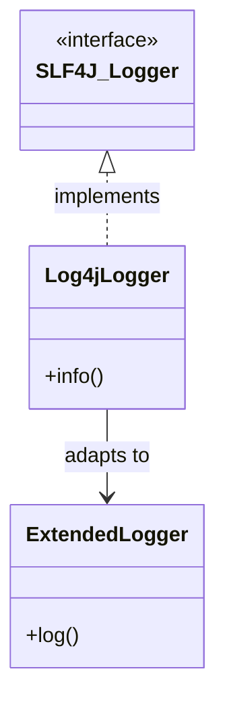
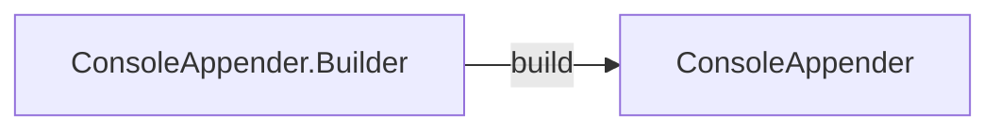
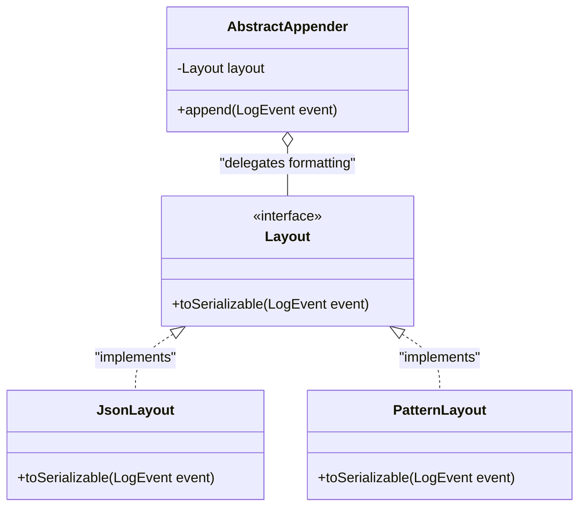
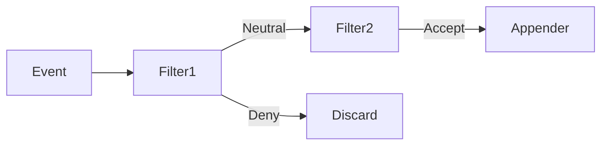

# Software Design — Apache Log4j2

## Dependencies

### Analysis Method
This dependency analysis is based on a reproducible static + history workflow implemented in:

- [generate_dependency_analysis.py](../tools/scripts/generate_dependency_analysis.py)
- [Dependency Runbook](../analysis/dependencies/README.md)

Locked analysis baseline:

- Source repo: `logging-log4j2`
- Branch: `2.x`
- Snapshot commit: `83702bb6194182572eccf6594acf935f83437e76`
- Scope modules: `log4j-core`, `log4j-api`, `log4j-layout-template-json`, `log4j-slf4j2-impl`, `log4j-jdbc-dbcp2`
- LOC convention: Java SLOC on `src/main/java` only

Reproducibility metadata and aggregate counts are recorded in:

- [summary.txt](../analysis/dependencies/summary.txt)
- [scope_loc.csv](../analysis/dependencies/scope_loc.csv)

Observed scope size:

- 92,131 SLOC (`src/main/java`)
- 929 Java production files
- 6,824 import edges
- Co-change window: 2025-04-12 to 2026-04-12
- 54 commits scanned, 18 commits contributing at least one file pair

### Code Dependencies
Code dependencies are extracted from Java `import` statements across scoped production files.
Evidence files:

- [import_edges.csv](../analysis/dependencies/import_edges.csv)
- [import_stats.csv](../analysis/dependencies/import_stats.csv)

Key module-level signals:

- Most imports target external libraries (`external` = 3,180 edges), then internal `log4j-core` (2,437) and `log4j-api` (1,147).
- `log4j-core` is the largest producer of imports (5,661 edges), consistent with its role as implementation nucleus.
- Strong cross-module flow appears from `log4j-core -> log4j-api` (816 imports), confirming API abstraction usage by core components.
- Bridge modules remain lightweight:
  - `log4j-slf4j2-impl`: 75 outgoing imports
  - `log4j-jdbc-dbcp2`: 29 outgoing imports

#### Files with Most Dependencies
Using `total = imports declared by the file + imports pointing to that file`:

- `log4j-core/.../config/plugins/Plugin.java` (`total=219`, `imports_received=213`)
  - Central annotation type reused by many plugin declarations, so references from other files dominate.
- `log4j-core/.../LogEvent.java` (`total=217`, `imports_received=208`)
  - Shared event contract used across appenders/layouts/filters, so it is referenced by many classes.
- `log4j-api/.../status/StatusLogger.java` (`total=185`)
  - Cross-cutting status logging utility with high reuse across API and implementation code.

#### Files with Least Dependencies
The lowest non-zero totals are interface/marker-style files (`total=1`), for example:

- `log4j-api/.../spi/CopyOnWrite.java` (`outgoing=0`, `incoming=1`)
  - Marker annotation with no internal composition logic.
- `log4j-api/.../internal/LogManagerStatus.java` (`outgoing=0`, `incoming=1`)
  - Minimal enum-like/constant-style role with intentionally narrow coupling.
- `log4j-core/.../Version.java` (`outgoing=0`, `incoming=1`)
  - Single-purpose metadata holder.

There are also 43 files with `total=0` in this scoped graph, typically highly isolated utility or marker units.

### Knowledge Dependencies (Co-change Analysis)
Knowledge dependencies are measured from commits in the selected time window using the same scoped file set.
Evidence files:

- [cochange_pairs.csv](../analysis/dependencies/cochange_pairs.csv)
- [inconsistencies.md](../analysis/dependencies/inconsistencies.md)

The strongest co-change values are low (max count = 2), which is coherent with a stable mature codebase and a one-year window focused on recent maintenance.

#### Key Findings
- **Configuration/network cluster around appender infrastructure**
  - Example pair: `SslSocketManager.java <-> SslConfiguration.java` (`cochange_count=2`, direct import present)
  - Interpretation: maintenance changes propagate from transport manager logic to SSL configuration.
- **Rolling appender strategy cluster**
  - Example pairs:
    - `DefaultRolloverStrategy.java <-> DirectWriteRolloverStrategy.java` (`2`, no direct import)
    - `RollingFileManager.java <-> RollingRandomAccessFileManager.java` (`2`, no direct import)
  - Interpretation: sibling strategies/managers evolve together due to shared policies and behavior alignment.
- **HTTP/SMTP connection management cluster**
  - Example pair: `HttpURLConnectionManager.java <-> UrlConnectionFactory.java` (`2`, no direct import)
  - Interpretation: co-change shows these files are often modified together even without direct imports.

#### Inconsistencies with Code Dependencies
Several high co-change pairs have **no direct import relation**. This indicates maintenance dependencies caused by shared feature work rather than direct compilation links.

Representative mismatches:

- `DefaultRolloverStrategy.java <-> DirectWriteRolloverStrategy.java`
- `HttpURLConnectionManager.java <-> UrlConnectionFactory.java`
- `FileManager.java <-> RollingRandomAccessFileManager.java`

These inconsistencies are not necessarily design defects; in this case they mostly reveal package-level and feature-level co-evolution (especially in rolling appenders and transport managers).

### Handoff Notes for Patterns and Design Summary
Inputs that should be reflected by the Patterns owner and in the final Design summary:

- Dependency hotspots (`Plugin.java`, `LogEvent.java`, `StatusLogger.java`) indicate stable extension points and shared abstractions.
- Co-change clusters in rolling appenders and connection managers show maintenance coupling that should be considered when discussing pattern alternatives.
- Design summary should state both views explicitly:
  - Import structure reveals intended architectural dependencies.
  - Co-change reveals practical maintenance dependencies across feature families.

---

## Patterns

### Architectural Patterns Mapping
| Pattern | Main classes/components | Module |
| :--- | :--- | :--- |
| **Adapter** | `Log4jLogger`, `org.slf4j.Logger`, `ExtendedLogger` | `log4j-slf4j2-impl` |
| **Builder** | `ConsoleAppender.Builder`, `ConsoleAppender` | `log4j-core` |
| **Strategy** | `Layout`, `PatternLayout`, `JsonLayout`, `LogEvent` | `log4j-core` |
| **Chain of Resp.** | `CompositeFilter`, `Filter`, `ThresholdFilter`, `RegexFilter` | `log4j-core` |

---

### Pattern 1: Adapter Pattern
*   **Classes/Components Involved:**
    *   **Adapter:** `org.apache.logging.slf4j.Log4jLogger`
    *   **Target (Interface):** `org.slf4j.Logger`
    *   **Adaptee:** `org.apache.logging.log4j.spi.ExtendedLogger`
*   **Location:** `log4j-slf4j2-impl/src/main/java/org/apache/logging/slf4j/Log4jLogger.java`
*   **Structure:**

*   **Analysis**: It translates SLF4J facade invocations into native Log4j2 API calls. This delegation enables interoperability between different logging frameworks, explaining the dependency flow from bridge modules toward the core implementation.
*   **Problem Solved:** Addresses the interface mismatch between the SLF4J standard and the Log4j2 internal API, allowing applications to switch backends without code changes.
*   **Alternative: Direct Implementation.** Log4j2 could natively implement the SLF4J interface.
*   **Pros:** Reduces architectural layers and eliminates the need for a separate bridge module.
*   **Cons:** Couples the Log4j2 core to an external API's lifecycle, potentially limiting the evolution of native features.
*   **Hotspot Link:** Explains the incoming dependencies from `log4j-slf4j2-impl` to the core `ExtendedLogger`.

### Pattern 2: Builder Pattern
*   **Classes/Components Involved:**
    *   **Builder:** `org.apache.logging.log4j.core.appender.ConsoleAppender.Builder`
    *   **Product:** `org.apache.logging.log4j.core.appender.ConsoleAppender`
*   **Location:** `log4j-core/src/main/java/org/apache/logging/log4j/core/appender/ConsoleAppender.java`
*   **Structure:**

*   **Analysis:** It standardizes the construction of complex components by validating configuration parameters before instantiation. Since every Builder is registered as a Plugin, this pattern centralizes imports toward `Plugin.java` for dynamic dependency injection.
*   **Problem Solved:** Manages the instantiation of complex components (Appenders) that require multiple optional configuration parameters without resorting to large, rigid constructors.
*   **Alternative: JavaBeans Pattern (Setters).** Using a default constructor followed by setter methods.
*   **Pros:** Simplifies the codebase by removing the nested Builder classes.
*   **Cons:** Permits the creation of "partially initialized" objects, which may lead to runtime errors if the component is started before all required fields are set.
*   **Hotspot Link:** Directly contributes to the high frequency of imports in `Plugin.java`, as the plugin system reflects on these builders to inject configuration values.

### Pattern 3: Strategy Pattern
*   **Classes/Components Involved:**
    *   **Strategy Interface:** `org.apache.logging.log4j.core.Layout`
    *   **Concrete Strategies:** `org.apache.logging.log4j.core.layout.PatternLayout`, `org.apache.logging.log4j.core.layout.JsonLayout`
    *   **Context:** `org.apache.logging.log4j.core.appender.AbstractAppender`
*   **Location:** `log4j-core/src/main/java/org/apache/logging/log4j/core/Layout.java`
*   **Structure:**

*   **Analysis:** It allows for interchangeable log formatting algorithms. Concrete Appenders (the context) delegate the formatting of each `LogEvent` to a `Layout` object. This decoupling explains why `LogEvent` is a high-frequency hotspot, as it is the shared data passed from the Appender to the Strategy.
*   **Problem Solved:** Decouples the destination of the log (Appender) from its data format (Layout), allowing the system to support new formats without modifying existing delivery logic.
*   **Alternative: Static Class Inheritance.** Creating specialized subclasses for every combination, such as `ConsoleJsonAppender`.
*   **Pros:** Provides a minor performance gain by using static binding instead of runtime delegation.
*   **Cons:** Results in a significant increase in the number of classes (combinatorial explosion), making the library harder to navigate and maintain.
*   **Hotspot Link:** The `LogEvent` serves as the shared state passed into every strategy, which is a direct factor in its status as a central dependency hotspot.

### Pattern 4: Chain of Responsibility
*   **Classes/Components Involved:**
    *   **Chain Manager:** `org.apache.logging.log4j.core.filter.CompositeFilter`
    *   **Handler Interface:** `org.apache.logging.log4j.core.Filter`
    *   **Concrete Handlers:** `org.apache.logging.log4j.core.filter.ThresholdFilter`, `org.apache.logging.log4j.core.filter.RegexFilter`
*   **Location:** `log4j-core/src/main/java/org/apache/logging/log4j/core/filter/CompositeFilter.java`
*   **Structure:**

*   **Analysis:** It organizes filters in a sequence where each element decides whether to accept, deny, or pass the log (Neutral) to the next handler. This structure decouples filtering logic, containing maintenance complexity within specific co-change clusters.
*   **Problem Solved:** Enables the combination of multiple independent filtering rules. Each filter can decide the fate of a log event without needing awareness of other filters in the pipeline.
*   **Alternative: Centralized Filter Logic.** A single conditional block within the Logger or Appender containing all logic.
*   **Pros:** Centralizes the filtering logic in one location, making the execution flow easier to trace linearly.
*   **Cons:** Reduces modularity; adding a specific rule (e.g., a `BurstFilter`) would require modifying the core filtering engine, increasing the risk of regression.
*   **Hotspot Link:** This pattern contributes to the observed co-change clusters among filter implementations, as updates to the filtering contract often require synchronized changes across handlers.

## Summary

### Main Dependency Findings

- The selected five-module scope (`log4j-core`, `log4j-api`, `log4j-layout-template-json`, `log4j-slf4j2-impl`, `log4j-jdbc-dbcp2`) contains 92,131 Java SLOC and 929 production files.
- `log4j-core` is the structural center in import-based analysis, with the strongest flow toward `log4j-api`.
- High-reference files such as `Plugin.java`, `LogEvent.java`, and `StatusLogger.java` act as shared extension or integration points.
- Co-change analysis confirms maintenance clusters in rolling appenders and connection managers.
- Some high co-change pairs have no direct imports, showing maintenance dependencies not visible from code structure alone.

### Pattern Impact

- **Managed Hotspots (Builder & Strategy):** Static analysis reveals high reference counts for `Plugin.java` and `LogEvent.java`, which align with structural design choices. The Builder Pattern allows the plugin system to inject dependencies dynamically, concentrating references in the plugin loader. Similarly, the Strategy Pattern (Layouts) requires `LogEvent` as a shared context object, naturally making it a central dependency for any formatting component.
- **Interoperability (Adapter):** The Adapter Pattern found in `log4j-slf4j2-impl` provides the structural bridge between external facades and the internal engine. By adapting the SLF4J interface to the native `ExtendedLogger` API, this pattern facilitates interoperability without necessitating changes to the core library's architecture.
- **Maintenance Isolation (Chain of Responsibility):** The use of the Chain of Responsibility for filtering logic helps explain the presence of "co-change clusters" in the maintenance data. By decoupling specific feature-level logic from the main logging pipeline, the architecture contains the impact of frequent modifications, preventing maintenance ripple effects from reaching the stable `log4j-api`.
- **Architectural Rationale:** The selection of these patterns suggests a preference for composition over rigid class inheritance. This approach helps manage the complexity of a highly configurable framework, maintaining a separation between the public-facing API and the modular, frequently evolving core implementation.

### Integration Notes

- Dependencies findings are evidence-backed through `analysis/dependencies/*` artifacts.
- Dependencies and Patterns are now integrated in a single cohesive summary.
- Final coordinator pass should verify wording consistency and traceability links.

---
