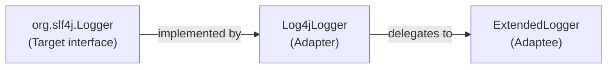
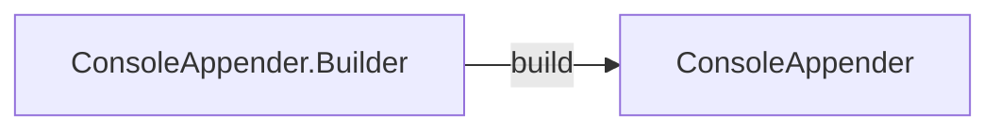
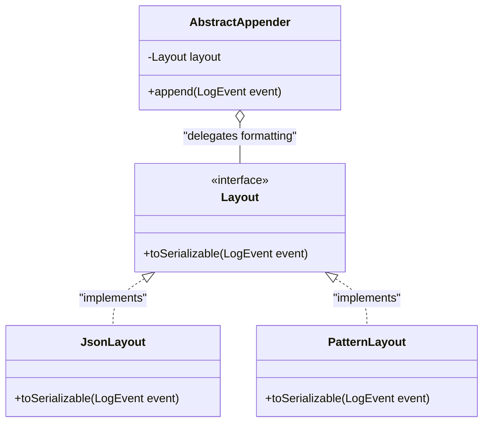
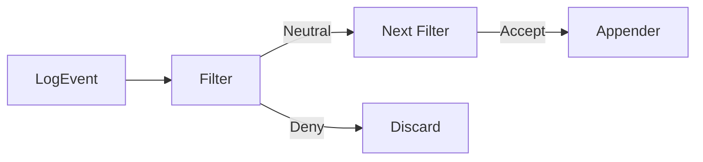

# Software Design - Apache Log4j2

## Dependencies

### Analysis Method
This dependency analysis combines static import extraction with recent co-change evidence. The workflow is reproducible and documented in:

- [generate_dependency_analysis.py](../tools/scripts/generate_dependency_analysis.py)
- [Dependency Runbook](../analysis/dependencies/README.md)

Locked analysis baseline:

- Source repo: `logging-log4j2`
- Branch: `2.x`
- Snapshot commit: `83702bb6194182572eccf6594acf935f83437e76`
- Scope modules: `log4j-core`, `log4j-api`, `log4j-layout-template-json`, `log4j-slf4j2-impl`, `log4j-jdbc-dbcp2`
- LOC convention: Java SLOC on `src/main/java` only

Reproducibility metadata and aggregate counts are recorded in:

- [summary.txt](../analysis/dependencies/summary.txt)
- [scope_loc.csv](../analysis/dependencies/scope_loc.csv)

Observed scope size:

- 92,131 SLOC (`src/main/java`)
- 929 Java production files
- 6,824 import edges
- Co-change window: 2025-04-12 to 2026-04-12
- 54 commits scanned, 18 commits contributing at least one file pair

### Code Dependencies
Code dependencies are extracted from Java `import` statements across the scoped production files. The main evidence files are:

- [import_edges.csv](../analysis/dependencies/import_edges.csv)
- [import_stats.csv](../analysis/dependencies/import_stats.csv)

The import graph shows `log4j-core` as the implementation center of the selected scope. Most imports target external libraries (`external` = 3,180 edges), followed by internal dependencies on `log4j-core` (2,437) and `log4j-api` (1,147). The strongest cross-module flow is `log4j-core -> log4j-api` (816 imports), which confirms that core implementation classes depend on the public API abstractions rather than the reverse direction.

Bridge modules stay comparatively lightweight. `log4j-slf4j2-impl` has 75 outgoing imports and `log4j-jdbc-dbcp2` has 29, which fits their role as integration layers around the central API/core design.

#### Files with Most Dependencies
Using `total = imports declared by the file + imports pointing to that file`, the main hotspots are:

- `log4j-core/.../config/plugins/Plugin.java` (`total=219`, `imports_received=213`): central annotation type reused by plugin declarations.
- `log4j-core/.../LogEvent.java` (`total=217`, `imports_received=208`): shared event contract used across appenders, layouts, and filters.
- `log4j-api/.../status/StatusLogger.java` (`total=185`): cross-cutting status logging utility reused across API and implementation code.

These hotspots are expected in a configurable logging framework. They are not isolated design defects; they are stable extension and integration points that many components need to reference.

#### Files with Least Dependencies
The lowest non-zero totals are interface/marker-style files (`total=1`), for example:

- `log4j-api/.../spi/CopyOnWrite.java` (`outgoing=0`, `incoming=1`): marker annotation with no internal composition logic.
- `log4j-api/.../internal/LogManagerStatus.java` (`outgoing=0`, `incoming=1`): minimal enum-like/constant-style role with intentionally narrow coupling.
- `log4j-core/.../Version.java` (`outgoing=0`, `incoming=1`): single-purpose metadata holder.

There are also 43 files with `total=0` in this scoped graph, typically highly isolated utility or marker units.

### Knowledge Dependencies (Co-change Analysis)
Knowledge dependencies are measured from commits in the selected time window using the same scoped file set. The main evidence files are:

- [cochange_pairs.csv](../analysis/dependencies/cochange_pairs.csv)
- [inconsistencies.md](../analysis/dependencies/inconsistencies.md)

The strongest co-change values are low (maximum count = 2). This is coherent with a mature codebase and a one-year window focused on recent maintenance rather than large-scale redesign.

#### Key Findings
- **Configuration/network cluster around appender infrastructure:** `SslSocketManager.java <-> SslConfiguration.java` (`cochange_count=2`, direct import present) shows that maintenance changes can propagate from transport manager logic to SSL configuration.
- **Rolling appender strategy cluster:** pairs such as `DefaultRolloverStrategy.java <-> DirectWriteRolloverStrategy.java` and `RollingFileManager.java <-> RollingRandomAccessFileManager.java` co-change without direct imports, suggesting sibling strategies and managers evolve together due to shared policies.
- **HTTP/SMTP connection management cluster:** `HttpURLConnectionManager.java <-> UrlConnectionFactory.java` (`2`, no direct import) shows feature-level maintenance coupling even when compilation dependencies are absent.

#### Inconsistencies with Code Dependencies
Several high co-change pairs have no direct import relation. Representative mismatches include:

- `DefaultRolloverStrategy.java <-> DirectWriteRolloverStrategy.java`
- `HttpURLConnectionManager.java <-> UrlConnectionFactory.java`
- `FileManager.java <-> RollingRandomAccessFileManager.java`

These inconsistencies show that static imports reveal intended architectural dependencies, while co-change reveals practical maintenance dependencies across feature families. In this scope, the mismatches mostly point to package-level and feature-level co-evolution in rolling appenders and transport managers.

---

## Patterns

### Architectural Patterns Mapping
| Pattern | Main roles/classes | Module | Dependency link |
| :--- | :--- | :--- | :--- |
| **Adapter** | Adapter: `Log4jLogger`; Target: `org.slf4j.Logger`; Adaptee: `ExtendedLogger` | `log4j-slf4j2-impl` | Explains bridge dependencies into the Log4j2 API/core stack. |
| **Builder** | Builder: `ConsoleAppender.Builder`; Product: `ConsoleAppender` | `log4j-core` | Explains recurring references to plugin-based construction metadata. |
| **Strategy** | Context: `AbstractAppender`; Strategy: `Layout`; Concrete strategies: `PatternLayout`, `org.apache.logging.log4j.core.layout.JsonLayout`; shared event object: `LogEvent` | `log4j-core` | Explains why `LogEvent` is a central formatting hotspot. |
| **Chain of Resp.** | Chain manager: `CompositeFilter`; Handler: `Filter`; Concrete handlers: `ThresholdFilter`, `RegexFilter` | `log4j-core` | Explains localized co-change across filtering behavior. |

`org.apache.logging.log4j.core.layout.JsonLayout` is the core layout used in the Strategy example. It is distinct from `JsonTemplateLayout` in the `log4j-layout-template-json` module discussed in the Architecture report.

---

### Pattern 1: Adapter Pattern
**Classes/components involved:** `org.apache.logging.slf4j.Log4jLogger`, `org.slf4j.Logger`, `org.apache.logging.log4j.spi.ExtendedLogger`
**Location:** `log4j-slf4j2-impl/src/main/java/org/apache/logging/slf4j/Log4jLogger.java`

| Analysis | Problem solved | Alternative | Pros | Cons | Hotspot link |
| :--- | :--- | :--- | :--- | :--- | :--- |
| `Log4jLogger` translates SLF4J facade calls into native Log4j2 API calls. | Resolves the interface mismatch between the SLF4J standard and the Log4j2 internal API, allowing applications to switch backends without changing application logging calls. | Directly implement the SLF4J interface inside the Log4j2 core. | Reduces architectural layers and avoids a separate bridge module. | Couples Log4j2 core to an external API lifecycle, which would limit native API evolution. | Explains incoming bridge dependencies from `log4j-slf4j2-impl` toward core/API logging abstractions. |

### Pattern 2: Builder Pattern
**Classes/components involved:** `org.apache.logging.log4j.core.appender.ConsoleAppender.Builder`, `org.apache.logging.log4j.core.appender.ConsoleAppender`
**Location:** `log4j-core/src/main/java/org/apache/logging/log4j/core/appender/ConsoleAppender.java`

| Analysis | Problem solved | Alternative | Pros | Cons | Hotspot link |
| :--- | :--- | :--- | :--- | :--- | :--- |
| The builder validates configuration parameters before creating the appender. Builders registered as plugins also concentrate metadata used by dynamic configuration. | Handles complex appender construction with optional configuration parameters without relying on large constructors. | JavaBeans-style construction with setters after a default constructor. | Simplifies class shape by removing nested builder classes. | Allows partially initialized objects and can move configuration errors from construction time to runtime. | Contributes to high references on `Plugin.java`, because the plugin system reflects on builders to inject configuration values. |

### Pattern 3: Strategy Pattern
**Classes/components involved:** `org.apache.logging.log4j.core.Layout`, `org.apache.logging.log4j.core.layout.PatternLayout`, `org.apache.logging.log4j.core.layout.JsonLayout`, `org.apache.logging.log4j.core.appender.AbstractAppender`, `org.apache.logging.log4j.core.LogEvent`
**Location:** `log4j-core/src/main/java/org/apache/logging/log4j/core/Layout.java`

| Analysis | Problem solved | Alternative | Pros | Cons | Hotspot link |
| :--- | :--- | :--- | :--- | :--- | :--- |
| Appenders delegate log formatting to interchangeable `Layout` implementations. `LogEvent` is the shared event object passed into each strategy. | Decouples the destination of a log event from its output format, allowing new formats without modifying delivery logic. | Static inheritance combinations such as `ConsoleJsonAppender`. | May provide minor static-binding simplicity in very small systems. | Creates combinatorial class growth and makes the framework harder to navigate and maintain. | Explains why `LogEvent` receives many references across appenders, layouts, and filters. |

### Pattern 4: Chain of Responsibility
**Classes/components involved:** `org.apache.logging.log4j.core.filter.CompositeFilter`, `org.apache.logging.log4j.core.Filter`, `org.apache.logging.log4j.core.filter.ThresholdFilter`, `org.apache.logging.log4j.core.filter.RegexFilter`
**Location:** `log4j-core/src/main/java/org/apache/logging/log4j/core/filter/CompositeFilter.java`

| Analysis | Problem solved | Alternative | Pros | Cons | Hotspot link |
| :--- | :--- | :--- | :--- | :--- | :--- |
| Filters are organized as a sequence where each handler can accept, deny, or pass the event onward. | Allows multiple independent filtering rules without forcing each filter to know the full pipeline. | Centralize all filtering logic in one logger/appender conditional block. | Makes execution flow more linear in a small implementation. | Reduces modularity; adding a rule such as `BurstFilter` would require changing the central filtering engine and increase regression risk. | Helps explain co-change among filtering implementations when the filtering contract or behavior changes. |

## Summary

The Design view shows a consistent relationship between structural dependencies and design patterns. Import analysis exposes the intended architecture: `log4j-core` is the implementation nucleus, `log4j-api` remains the stable abstraction layer, and bridge modules depend inward rather than forcing dependencies back into the public API. Co-change analysis adds the maintenance view: rolling appenders, transport managers, and filtering components sometimes evolve together even when they do not directly import each other.

The selected patterns help manage that complexity. Builder and Strategy concentrate references around stable extension points such as `Plugin.java` and `LogEvent.java`; Adapter preserves interoperability with external logging facades; and Chain of Responsibility keeps filtering behavior modular. Together, these choices support a configurable framework that can evolve feature families while keeping the public API and core abstractions stable.

Traceability for these claims is maintained through the dependency artifacts in [analysis/dependencies](../analysis/dependencies), especially the import statistics, co-change pairs, and inconsistency notes.

---
