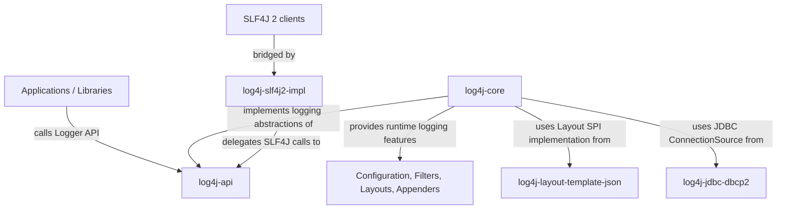

# Overview - Apache Log4j2

## Purpose and Stakeholders

Apache Log4j2 is an open-source logging framework for Java and other JVM-based
applications. Its purpose is to let applications produce, configure, route, and
format log events without hard-coding logging behavior into business logic.
Log4j2 provides both the API used by applications and the backend that processes
log events. Applications call stable logging interfaces, while the framework
handles configuration, filtering, asynchronous processing, layouts, appenders,
and integrations with other logging ecosystems.

The main stakeholders are:

- **Application and library developers**, who use the API to add logging and
  diagnostics to their systems.
- **Operations, DevOps, and security teams**, who rely on logs for monitoring,
  incident analysis, auditing, troubleshooting, and safe configuration.
- **Apache Log4j maintainers and contributors**, who evolve the framework,
  review changes, and preserve compatibility across releases.
- **Downstream users**, who depend on Log4j2 as a reliable infrastructure
  library.

## System Description

Log4j2 is organized as a multi-module Maven project. The public project page
describes it as a feature-rich Java logging API and backend; its repository also
contains many optional adapters and integration modules. In a typical logging
flow, application code creates log events through the API. The implementation
then evaluates configuration and filters, and appenders/layouts deliver the
final output to targets such as files, consoles, network endpoints, or
structured formats.

This project does not analyze the entire Log4j2 repository. Instead, the
analysis focuses on five production modules that represent the main logging
API, runtime implementation, output formatting, adapter, and infrastructure
integration concerns:

- `log4j-api`, the public API used by application and library code.
- `log4j-core`, the main implementation module, including configuration,
  appenders, filters, layouts, and runtime logging behavior.
- `log4j-layout-template-json`, a structured JSON layout module.
- `log4j-slf4j2-impl`, a bridge that lets SLF4J 2 clients use Log4j2.
- `log4j-jdbc-dbcp2`, a small JDBC appender integration based on DBCP2.

These modules were selected because together they cover the main API, the core
implementation, structured logging output, and examples of integration with
other logging or output technologies.

The following diagram summarizes the selected analysis scope:

The scope diagram is a high-level responsibility and integration view, not a
complete dependency graph. Detailed dependency directions and evidence are
reported in the Design and Architecture reports.

This scope covers the relationship between the public API and the
implementation, the main runtime extension mechanisms, one structured-output
component, and two integration-oriented modules. Test modules, documentation
modules, fuzzing modules, and most peripheral adapters are intentionally
excluded from the quantitative design analysis.

Detailed dependency evidence for this scope is reported in the
[Design report](design.md) and in the generated
[analysis artifacts](../analysis/dependencies/).

## Code Statistics

The statistics below refer to the selected scope only, unless otherwise stated.
They are based on Java production files under `src/main/java` and on the
reproducible dependency analysis artifacts in
[`analysis/dependencies`](../analysis/dependencies/).
The file and SLOC counts come from
[`tools/scripts/generate_dependency_analysis.py`](../tools/scripts/generate_dependency_analysis.py),
which writes the scoped module totals to
[`scope_loc.csv`](../analysis/dependencies/scope_loc.csv) and the aggregate
snapshot to [`summary.txt`](../analysis/dependencies/summary.txt). Repository
metadata such as contributors and activity status was recorded from the public
GitHub project pages on 2026-05-02.

| Metric | Value |
|--------|-------|
| Scoped Java production files | 929 |
| Scoped Java source lines of code (SLOC) | 92,131 |
| Scoped modules | 5 |
| Repository-level contributors | 244+ public GitHub contributors |
| Repository Link | https://github.com/apache/logging-log4j2 |
| Primary Language | Java |
| Analyzed Branch / Baseline | `2.x` / `83702bb6194182572eccf6594acf935f83437e76` |
| Current Status | Active public project; GitHub showed open pull requests and recent releases on 2026-05-02 |

Scoped SLOC by module:

| Module | Java SLOC |
|--------|----------:|
| `log4j-core` | 68,024 |
| `log4j-api` | 16,608 |
| `log4j-layout-template-json` | 6,110 |
| `log4j-slf4j2-impl` | 982 |
| `log4j-jdbc-dbcp2` | 407 |

---
